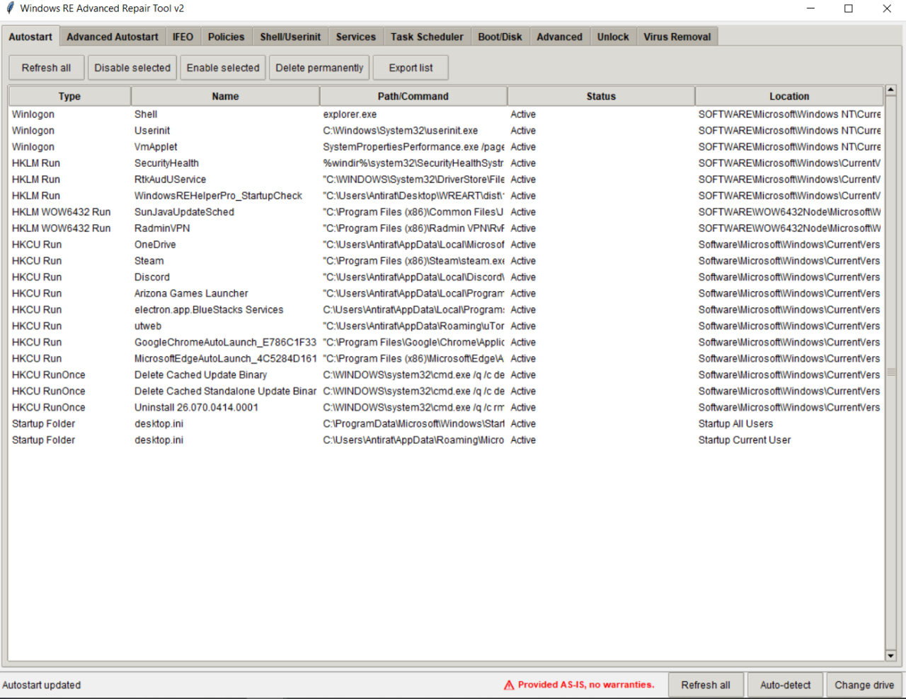

# Windows RE Advanced Repair Tool (WREART)

**WREART** is a powerful portable utility designed to clean, repair, and restore Windows systems — both from within a running Windows environment and, more importantly, from **Windows Recovery Environment (WinRE)**. It is a Swiss Army knife for malware removal, system policy fixes, and boot recovery.

License: GPL v3 https://www.gnu.org/licenses/gpl-3.0

---

## ✨ Key Features

### 🧹 Startup & Autoruns
- View and manage standard autostart locations (Run, RunOnce, Startup folder)
- Advanced autostart locations: `BootExecute`, `AppInit_DLLs`, `KnownDLLs`, `Winlogon Notify`, `Active Setup`, `RunServices`, and more
- Disable, enable, or delete autostart entries

### 🔧 System Policies & Restrictions
- View and reset common group policies (Task Manager, Registry, CMD, Control Panel, etc.)
- Unlock restricted system components

### 🛡️ IFEO (Image File Execution Options)
- List and remove debugger hooks used by malware to hijack legitimate processes or block it

### ⚙️ Critical Boot Parameters
- Edit `Shell` and `Userinit`
- View and edit all `Winlogon` parameters

### 📋 Services & Task Scheduler
- List, start, stop, delete, and change startup type of Windows services
- Create, delete, and export scheduled tasks

### 💾 Boot & Disk Recovery
- Restore MBR, fix bootloader, rebuild BCD
- Run CHKDSK, SFC, and DISM offline (from WinRE)

### 🔓 Unlock Tools
- One‑click unlock for: Task Manager, Registry Editor, Command Prompt, Control Panel
- Reset all group policies, restore file associations, repair system fonts

### 🦠 Malware Removal Scripts
- Run custom `.bat` removal scripts for known RATs and winlockers
- Supported scripts: `raton`, `xworm`, `webrat`, `000`, `noescape`, `dcrat`, `njrat`, `sheetrat`
- Place your `.bat` files in the `scripts` folder

### 📊 Startup Process Logger
- Creates a scheduled task that logs all user‑launched processes after login
- Helps identify hidden malware that does not appear in standard autostart

### 🧠 WinRE / Offline Mode
- Automatically detects Windows Recovery Environment
- Mounts offline registry hives (`SYSTEM`, `SOFTWARE`, `SAM`, `SECURITY`)
- Works on the target system without booting into it

### 🛠️ Additional Tools
- Registry backup/restore, load/unload hives
- List local users and reset passwords
- Block `.exe` execution from `%TEMP%` folders (SRP policy)

---

## 📸 Screenshot

> 

---

## 🚀 Download

Get the latest release from the [Releases page](https://github.com/AntiRAT/WREART/releases).

No installation required — just run the `.exe` as Administrator.

---

## 🧪 System Requirements

- Windows 10 / Windows 11 (x64)
- Windows Recovery Environment (WinRE) recommended for offline repair

---

## 🧰 How to Use

### Normal Mode (running Windows)
1. Right‑click `WREART.exe` → **Run as Administrator**
2. Navigate through tabs to inspect and fix your system

### WinRE Mode (recommended for deep cleaning)
1. Boot into Windows Recovery Environment:
   - `Shift + Restart` → Troubleshoot → Advanced Options → Command Prompt
   - Or boot from a Windows installation USB → Repair your computer
2. Navigate to the drive where Windows is installed (usually `C:` or `D:`)
3. Run `WREART.exe` from there as Administrator
4. The program will automatically mount offline registry hives

> ⚠️ **Important:** In WinRE mode, many local user‑specific features (HKCU) are unavailable. Focus on HKLM sections.

---

## 🧩 Scripts for Virus Removal

1. Create a folder named `scripts` next to `WREART.exe`
2. Place your `.bat` removal scripts there (use the exact names listed above)
3. Go to the **Virus Removal** tab and click **Run**

Donate me: https://www.donationalerts.com/r/antirat
Telegram-channel: https://t.me/antiratnik